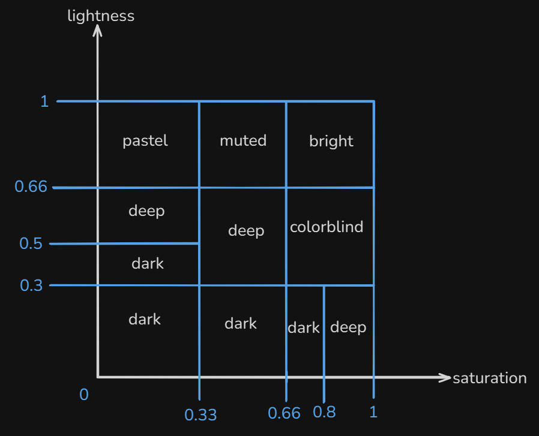

# Logo-Clustering
======= 
The following project represents the solution to assignment "#1 Logos" for the Deep Tech Intern position at Veridion. Below, I will detail the steps and reasoning behind my approach to solving this task.

The assignment involved classifying the logos of approximately 3500 websites. Given the open-ended requirements, I approached classification through several criteria:

### Logo Classifications Implemented:

1. **Text/Symbol Classification:** Identifies logos containing text versus symbolic logos.
2. **Color Similarity Classification:** Not explicitly labeled.
3. **Palette Color Classification:** Categorizes logos into 'bright', 'colorblind', 'dark', 'deep', 'pastel', 'muted', and combinations, based on Seaborn palettes<a href="https://seaborn.pydata.org/_images/color_palettes_22_0.svg">[1]</a>.
4. **Minimalist Classification:** Determines if logos are minimalist or not.
5. **Industry Classification using ResNet50:** Classifies logos into 10 industries using image features. Low accuracy (as expected).
6. **Industry Classification using Naive Bayes:** Classifies logos into 11 industries based on website content scraping, achieving better accuracy compared to image-based methods but limited by a small dataset (~700 websites).

### Data Preprocessing:

Data was collected using the ClearBit API, successfully retrieving logos with less than 10% errors (~300 incorrect results). ClearBit sufficed for a small dataset but would need replacement with an enterprise-friendly API for scaling.

#### Steps for Data Preprocessing:

**1. Downloading Logos (`load.py`):**
- Converted parquet files into datasets using pandas.
- Ensured data cleanliness (no duplicates or empty fields).
- Fetched logos using ClearBit and requests library.
- Potential improvement: Direct website scraping.

**2. Duplicate Removal (`deldup.py`):**
Duplicate identification was the most challenging preprocessing step:
- Implemented perceptual hashing (pHash) on greyscale images, effectively identifying ~1050 duplicates.
- Used ResNet50 pre-trained model for feature extraction, clustering logos based on Euclidean distance (DBSCAN).
- Verified brand uniqueness within clusters using fuzzy regex matching.

I thought the most straightforward approach would be to use a model capable of extracting features from each logo and then classify them based on Euclidean distance, using a certain threshold. However, calculating this feature matrix requires considerable computational power and takes a long time. To improve efficiency, I first computed the perceptual hash (pHash) for each logo converted to grayscale. Grayscale conversion significantly improves computational efficiency since perceptual hashing relies on low-frequency pixels using a Discrete Cosine Transform (DCT). Adjustments in color histograms or gamma parameters don't affect the hash outcome, making this method ideal for detecting identical logos with slight variations due to differing image quality (see here).

The pHash approach successfully identified approximately 1050 duplicates; however, many duplicates remained undetected. Therefore, I took a second step, leveraging a pre-trained model (ResNet50) to compute a feature matrix for the logos and perform clustering based on Euclidean distance with the DBSCAN algorithm. To ensure I wouldn't mistakenly remove logos from different brands that appeared similar visually (e.g., 'ajas.cz' and 'avon.com' being clustered together), I performed a double-check using brand names, carefully reviewing each cluster to verify individual brands.

**3. Logo Image Standardization (`rmbg.py`):**
- Standardized logo images to a consistent resolution (256x256), maintaining logo quality.
- Cropped logos by detecting the background color using edge pixels, generating masks, and using OpenCV bounding rectangles.
- Scaled logos and applied padding to achieve uniform square dimensions.

### Logo Classification Methods:

#### I. Text/Symbol Classification (`tscls.py`):
- Used Tesseract OCR, applying slight blur to prevent false text detection.
- Only text predictions above a 50% confidence threshold were accepted.
 
 

#### II. Color Classification (`color.py`):
- Extracted dominant colors using KMeans clustering (maximum 5 clusters per logo).
- Standardized color vectors, ensuring uniform size for feature consistency.
- Optimized thresholds using silhouette scores and Euclidean distances with Agglomerative Clustering.

#### III. Color Palette Classification (`cp_cls.py`):
- Classified logos into predefined palette categories using HLS color space, creating rule-based intervals.
- Divided logos into 8x8 pixel patches, averaging colors to accurately represent the overall palette.
 
 

#### IV. Minimalist Classification (`min_cls.py`):
- Applied Canny edge detection on grayscale images.
- Calculated edge density, classifying logos with densities below a manually determined threshold (4%) as minimalist. 

#### V. Industry Classification (ResNet50) (`resnet.py`):
- Fine-tuned pre-trained ResNet50 for logo-based industry classification (10 industries).
- Added custom layers (ReLU layers: 128, 50 neurons; output: 10 neurons).
- Dataset: 70% train, 30% test; training set further split (20% validation).
- Achieved low accuracy (54%), intuitively expected for two main reasons: firstly, classifying logos accurately by industry is challenging without additional contextual information; secondly, the ResNet50 model is pretrained on ImageNet, a general-purpose image dataset that doesn't specifically include logos, limiting its effectiveness for this specialized task. 
 
 
 

#### VI. Industry Classification (Naive Bayes):
- Scraped text from websites using BeautifulSoup and requests.
- Created a manually curated dataset (~770 sites across 10 industries, not the best, I know).
- Used proxies and Google's translation model (`googletrans`) for dealing with language inconsistencies.
- Applied Naive Bayes on textual content, achieving improved but limited accuracy due to dataset size and occasional request failures.
- Proposed future improvement: train a more extensive model on a larger dataset, potentially including classification based on website/company names as a fallback. 

 

**Observations:**
- The Naive Bayes model showed signs of overfitting but improved validation accuracy with additional data, suggesting scalability potential despite initial dataset limitations.

Overall, this project demonstrated proof-of-concept methods with clear avenues for enhancement, particularly through dataset expansion and API optimization for enterprise scalability.

# Before running the code, please ensure you have the following libraries installed:
- numpy
- pandas
- matplotlib
- seaborn
- scikit-learn
- opencv-python
- pytesseract
- pillow
- cv2
- tensorflow
- keras
- googletrans
- beautifulsoup4
- shutil
- PIL
- requests
- imagehash
- regex
- joblib
- nltk
- torch
- torchvision
#### If you don't want to install Tesseract OCR, you can comment the "Text/Symbol Classification" section in `Logos.py`. ####

## To run the code, simply run the `Logos.py` file. ##
#### There is also a `save.py` file that creates directories for saving the results of each classification method. To use it, all you have to do is changing the csv_file variable to the csv file you want to save the results of and run it. ####
#### The models are already trained and saved. If you want to skip training and use the saved models, you can comment the training part in the `resnet.py` and `NB.py` files. ####
#### I recommend using the already pre-trained ResNet50 model, since the dataset is only a sample of the one I used for its training. ####
